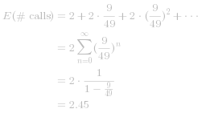

#### 方法一：拒绝采样

我们可以用拒绝采样的方法实现 `Rand10()`。在拒绝采样中，如果生成的随机数满足要求，那么久返回该随机数，否则会不断生成直到一个满足要求的随机数为止。若我们调用两次 `Rand7()`，那么可以生成 `[1, 49]` 之间的随机整数，我们只用到其中的 `40` 个，用来实现 `Rand10()`，而拒绝剩下的 `9` 个数，如下图所示。


我们来分析这种方法在平均情况下需要调用 `Rand7()` 的次数。我们称连续调用两次 `Rand7()` 为一轮，在第一轮中，有 `40/49` 的概率不被拒绝，而有 `9/49` 的概率被拒绝，进入第二轮。在第二轮中也是如此，因此调用 `Rand7()` 的期望次数为：

 

```C++ [sol1]
class Solution {
public:
    int rand10() {
        int row, col, idx;
        do {
            row = rand7();
            col = rand7();
            idx = col + (row - 1) * 7;
        } while (idx > 40);
        return 1 + (idx - 1) % 10;
    }
};
```

```Java [sol1]
class Solution extends SolBase {
    public int rand10() {
        int row, col, idx;
        do {
            row = rand7();
            col = rand7();
            idx = col + (row - 1) * 7;
        } while (idx > 40);
        return 1 + (idx - 1) % 10;
    }
}
```

**复杂度分析**

* 时间复杂度：期望时间复杂度为 *O(1)*，但最坏情况下会达到  （一直被拒绝）。

* 空间复杂度：*O(1)*。

#### 方法二：合理使用被拒绝的随机数

我们可以通过合理地使用被拒绝的采样，从而对方法一进行优化。

在方法一中，我们生成 `[1, 49]` 的随机数，若生成的随机数 `x` 在 `[41, 49]` 中，我们则拒绝 `x`。然而在 `x` 被拒绝的情况下，我们得到了一个 `[1, 9]` 的随机数，如果再调用一次 `Rand7()`，那么就可以生成 `[1, 63]` 的随机数。我们保留 `[1, 60]` 并拒绝 `[61, 63]`：这是 `[1, 3]` 的随机数。我们继续调用 `Rand7()`，生成 `[1, 21]` 的随机数，保留 `[1, 20]` 并拒绝 `[1]`。此时 `[1]` 已经没有任何用处，若出现了拒绝 `1` 的情况，我们就重新开始生成 `[1, 49]` 的随机数。

使用类似的期望计算方法，我们可以得到调用 `Rand7` 的期望次数约为 2.2123。

```C++ [sol2]
class Solution {
public:
    int rand10() {
        int a, b, idx;
        while (true) {
            a = rand7();
            b = rand7();
            idx = b + (a - 1) * 7;
            if (idx <= 40)
                return 1 + (idx - 1) % 10;
            a = idx - 40;
            b = rand7();
            // get uniform dist from 1 - 63
            idx = b + (a - 1) * 7;
            if (idx <= 60)
                return 1 + (idx - 1) % 10;
            a = idx - 60;
            b = rand7();
            // get uniform dist from 1 - 21
            idx = b + (a - 1) * 7;
            if (idx <= 20)
                return 1 + (idx - 1) % 10;
        }
    }
};
```

```Java [sol2]
class Solution extends SolBase {
    public int rand10() {
        int a, b, idx;
        while (true) {
            a = rand7();
            b = rand7();
            idx = b + (a - 1) * 7;
            if (idx <= 40)
                return 1 + (idx - 1) % 10;
            a = idx - 40;
            b = rand7();
            // get uniform dist from 1 - 63
            idx = b + (a - 1) * 7;
            if (idx <= 60)
                return 1 + (idx - 1) % 10;
            a = idx - 60;
            b = rand7();
            // get uniform dist from 1 - 21
            idx = b + (a - 1) * 7;
            if (idx <= 20)
                return 1 + (idx - 1) % 10;
        }
    }
}
```

**复杂度分析**

* 时间复杂度：期望时间复杂度为 *O(1)*，但最坏情况下会达到  （一直被拒绝）。

* 空间复杂度：*O(1)*。