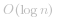

### 方法一：暴力法（Brute Force）

无视题目“你的算法时间复杂度必须是   级别”这项要求，采用线性扫描的方式搜索。

**参考代码 1**：

```Java []
public class Solution {
    
    public int search(int[] nums, int target) {
        int len = nums.length;
        for (int i = 0; i < len; i++) {
            if (nums[i] == target) {
                return i;
            }
        }
        return -1;
    }
}
```

**复杂度分析**：

+ 时间复杂度：*O(N)*，这里 *N* 是数组的长度。
+ 空间复杂度：*O(1)*，使用到的临时变量的个数是常数。

### 方法二：二分查找（Binary Search）


二分查找法模板请参考：「力扣」第 35 题：“搜索插入位置”[题解](https://leetcode-cn.com/problems/search-insert-position/solution/te-bie-hao-yong-de-er-fen-cha-fa-fa-mo-ban-python-/)。

题目中说：

> 你的算法时间复杂度必须是   级别。

暗示我们可以使用二分查找算法。题目中还说说：

> **你可以假设数组中不存在重复的元素**。

根据示例 `[4, 5, 6, 7, 0, 1, 2]` ，自己手写几个旋转数组。

不难发现：将待搜索区间从中间一分为二，**`mid` 一定会落在其中一个有序区间里**。


因为题目不允许我们逐个扫描，因此待搜索区间的第 1 个索引的位置、最后一个索引的位置、中间索引的位置就很重要，事实上，我们很容易能够根据中间索引的位置和第 1 个索引的位置（或者最后一个索引的位置）判断 `mid` 落在哪个有序的区间里。

还可以这样理解：中间元素把待搜索区间分成了两部分，两部分具有的性质是至少有一部分是有序的。

我们不妨讨论**中间元素和右边界的关系**（其它情况类似），因为不存在重复元素，所以它们的关系不是大于就是小于。

+ 情况 1：`nums[mid] < nums[right]`，当中间元素的数值严格小于右边界的数值时候

1、此时区间 `[mid, right]` （表示左闭右闭，下同）一定是有序的；

2、因为 `target` 要么在有序区间 `[mid, right]` 里，要么在另一个区间 `[left, mid - 1]` 里。

（1）显然在有序区间 `[mid, right]` 里的条件好写，即：`nums[mid] <= target <= nums[right]`。因为 `target` 落在其中，所以能且只能等于其中的一个元素，当然包括头尾，此时设置 `left = mid`；

（2）落在另一个区间 `[left, mid - 1]` 里的时候，就是上一个情况的反面，这种情况用 `else` 表示即可，此时设置 `right = mid - 1` 是显然的。

> **关键**：把比较好些的判断（`target` 落在有序的那部分）放在 `if` 的开头考虑，把剩下的情况放在 `else` 里面。

同理，讨论 `nums[mid] < nums[right]` 的反面（下面我的描述基本就是反过来讲的）。

+ 情况 2：`nums[mid] > nums[right]`，当中间元素的数值严格小于右边界的数值时候，因为没有重复元素，所以是严格大于

1、此时区间 `[left, mid]` 内的元素一定是有序的；

2、因为 `target` 要么在有序区间 `[left, mid]` 里，要么在另一个区间 `[mid + 1, right]` 里。

（1）显然在有序区间 `[left, mid]` 里的条件好写，即：`nums[left] <= target <= nums[mid]`。因为 `target` 落在其中，所以能且只能等于其中的一个元素，当然包括头尾，此时设置 `right = mid`；

（2）落在另一个区间 `[mid + 1, right]` 里的时候，就是上一个情况的反面，这种情况用 `else` 表示即可，此时设置 `left = mid + 1` 是显然的。


此时发现：

情况 1 分支左右边界的收缩情况是：`left = mid` 与 `right = mid - 1`，它对应的中间数的取法是 `int mid = (left + right + 1) >>> 1;`；

情况 2 分支左右边的收缩情况是：`left = mid + 1` 与 `right = mid`，它对应的中间数的取法是 `int mid = (left + right) >>> 1;`，为了让二者一致，我们在情况 2 里强行只认为 [left, mid - 1] 有序。这样左右边界的收缩情况就和情况 1 一样了。

因为中间数的取法都是 `int mid = (left + right + 1) >>> 1;`； 因此在区间只剩下两个元素的时候，`mid` 会取到第 2 个元素，此时 `mid - 1` 一定不会越界。

**参考代码 2**：

```Java []
public class Solution {

    public int search(int[] nums, int target) {
        int len = nums.length;
        if (len == 0) {
            return -1;
        }

        int left = 0;
        int right = len - 1;
        while (left < right) {

            int mid = left + (right - left  + 1) / 2;

            if (nums[mid] < nums[right]) {

                // 使用上取整的中间数，必须在上面的 mid 表达式的括号里 + 1
                if (nums[mid] <= target && target <= nums[right]) {
                    // 下一轮搜索区间是 [mid, right]
                    left = mid;
                } else {
                    // 只要上面对了，这个区间是上面区间的反面区间，下一轮搜索区间是 [left, mid - 1]
                    right = mid - 1;
                }

            } else {

                // [left, mid] 有序，但是为了和上一个 if 有同样的收缩行为，
                // 我们故意只认为 [left, mid - 1] 有序
                // 当区间只有 2 个元素的时候 int mid = (left + right + 1) >>> 1; 一定会取到右边
                // 此时 mid - 1 不会越界，就是这么刚刚好

                if (nums[left] <= target && target <= nums[mid - 1]) {
                    // 下一轮搜索区间是 [left, mid - 1]
                    right = mid - 1;
                } else {
                    // 下一轮搜索区间是 [mid, right]
                    left = mid;
                }
            }
        }

        // 有可能区间内不存在目标元素，因此还需做一次判断
        if (nums[left] == target) {
            return left;
        }
        return -1;
    }
}
```

**复杂度分析**：

+ 时间复杂度： ，这里 *N* 是数组的长度，在循环中一次排除一半，因此时间复杂度是对数级别的。
+ 空间复杂度：*O(1)*，使用到的临时变量的个数是常数。

欢迎大家查阅这个题解的评论区下，用户 [@gehui1007](/u/gehui1007) 提供的 Python 代码，他给出了 5 种情况下的分类讨论代码，并且有详细的注释。

1、中间元素和右边界比较，使用右中位数；
2、中间元素和右边界比较，使用左中位数；
3、中间元素和左边界比较，使用右中位数；
4、中间元素和左边界比较，使用左中位数；
5、中间元素和左边界比较，使用左中位数（使用最原始的二分查找法模板）。

**编码关键之处**：

1、`if` 语句的编写，注意细节，调整等于或者不等号，使得左右边界收缩的行为一致，这一点需要大家自己编写的时候才能发现；

说明：在本题的精选题解处，有更好的 `if` 语句的写法，大家可以前往欣赏和学习。

2、在写代码的过程中有遇到问题，首先还是建议自己找问题，可以在代码中打印一些变量进行 debug，然后再找到他写的符合自己思路的代码进行比对，找出问题所在。

