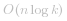

## 滑动窗口 & 二分

**根据题意，对于任意一个位置 *i*（假设其值为 *u*），我们其实是希望在下标范围为 *[max(0, i - k), i)* 内找到值范围在 *[u - t, u + t]* 的数。**

因此我们可以使用一个「有序集合」去维护长度为 *k* 的滑动窗口内的数。

**每次都在「有序集合」中应用「二分查找」，找到「小于等于 *u* 的最大值」和「大于等于 *u* 的最小值」，即「有序集合」中的最接近 *u* 的数。然后判断两值是否落在 *[u - t, u + t]* 范围内。**


由于我们希望对「有序集合」应用「二分」，找到最接近 *u* 的数，因此我们需要使用 *TreeSet* 数据结构（基于红黑树，因此查找和插入都具有折半的效率），并且由于 *nums* 中的数较大，会存在 *int* 溢出问题，我们需要使用 *long* 来存储。


**代码（感谢 [@Benhao](/u/qubenhao/) 和 [@wqs](/u/wqswqswswqs/) 提供的其他语言版本 ）：**
```java []
class Solution {
    public boolean containsNearbyAlmostDuplicate(int[] nums, int k, int t) {
        int n = nums.length;
        TreeSet<Long> ts = new TreeSet<>();
        for (int i = 0; i < n; i++) {
            Long u = nums[i] * 1L;
            // 从 ts 中找到小于等于 u 的最大值（小于等于 u 的最接近 u 的数）
            Long l = ts.floor(u); 
            // 从 ts 中找到大于等于 u 的最小值（大于等于 u 的最接近 u 的数）
            Long r = ts.ceiling(u); 
            if(l != null && u - l <= t) return true;
            if(r != null && r - u <= t) return true;
            // 将当前数加到 ts 中，并移除下标范围不在 [max(0, i - k), i) 的数（维持滑动窗口大小为 k）
            ts.add(u);
            if (i >= k) ts.remove(nums[i - k] * 1L);
        }
        return false;
    }
}
```
```c++ []
class Solution {
public:
    bool containsNearbyAlmostDuplicate(vector<int>& nums, int k, int t) {
        set<long> st;
        for (int i = 0; i < nums.size(); i++) {
            auto lb = st.lower_bound((long)nums[i] - t);
            if (lb != st.end() && *lb <= (long)nums[i] + t) return 1;
            st.insert(nums[i]);
            if (i >= k) st.erase(nums[i - k]);
        }
        return 0;
    }
};
```
```python []
from sortedcontainers import SortedList

class Solution:
    def containsNearbyAlmostDuplicate(self, nums: List[int], k: int, t: int) -> bool:
        # O(N logk)
        window = SortedList()
        for i in range(len(nums)):
            # len(window) == k
            if i > k:
                window.remove(nums[i - 1 - k])
            window.add(nums[i])
            idx = bisect.bisect_left(window, nums[i])
            if idx > 0 and abs(window[idx] - window[idx-1]) <= t:
                return True
            if idx < len(window) - 1 and abs(window[idx+1] - window[idx]) <= t:
                return True
        return False
```
* 时间复杂度：*TreeSet* 基于红黑树，查找和插入都是 *O(log{k})* 复杂度。整体复杂度为  
* 空间复杂度：*O(k)*

***

## 桶排序

**上述解法无法做到线性的原因是：我们需要在大小为 *k* 的滑动窗口所在的「有序集合」中找到与 *u* 接近的数。**

**如果我们能够将 *k* 个数字分到 *k* 个桶的话，那么我们就能 *O(1)* 的复杂度确定是否有 *[u - t, u + t]* 的数字（检查目标桶是否有元素）。**

具体的做法为：令桶的大小为 *size = t + 1*，根据 *u* 计算所在桶编号：

* 如果已经存在该桶，说明前面已有 *[u - t, u + t]* 范围的数字，返回 *true*
* 如果不存在该桶，则检查相邻两个桶的元素是有 *[u - t, u + t]* 范围的数字，如有 返回 *true*
* 建立目标桶，并删除下标范围不在 *[max(0, i - k), i)* 内的桶

**代码（感谢 [@Benhao](/u/qubenhao/) 和 [@answerer](/u/answerer/) 提供的其他语言版本 ）：**
```java []
class Solution {
    long size;
    public boolean containsNearbyAlmostDuplicate(int[] nums, int k, int t) {
        int n = nums.length;
        Map<Long, Long> map = new HashMap<>();
        size = t + 1L;
        for (int i = 0; i < n; i++) {
            long u = nums[i] * 1L;
            long idx = getIdx(u);
            // 目标桶已存在（桶不为空），说明前面已有 [u - t, u + t] 范围的数字
            if (map.containsKey(idx)) return true;
            // 检查相邻的桶
            long l = idx - 1, r = idx + 1;
            if (map.containsKey(l) && u - map.get(l) <= t) return true;
            if (map.containsKey(r) && map.get(r) - u <= t) return true;
            // 建立目标桶
            map.put(idx, u);
            // 移除下标范围不在 [max(0, i - k), i) 内的桶
            if (i >= k) map.remove(getIdx(nums[i - k] * 1L));
        }
        return false;
    }
    long getIdx(long u) {
        return u >= 0 ? u / size : (u + 1) / size - 1;
    }
}
```
```c++ []
class Solution {
public:
    long size;
        bool containsNearbyAlmostDuplicate(vector <int> & nums, int k, int t) {
        int n = nums.size();
        map<long, long> m;
        size = t + 1L;
        for (int i = 0; i < n; i++) {
            long u = nums[i] * 1L;
            long idx = getIdx(u);
            // 目标桶已存在（桶不为空），说明前面已有 [u - t, u + t] 范围的数字
            if (m.find(idx) != m.end()) return true;
            // 检查相邻的桶
            long l = idx - 1, r = idx + 1;
            if (m.find(l) != m.end() && abs(u - m[l]) <= t) return true;
            if (m.find(r) != m.end() && abs(u - m[r]) <= t) return true;
            // 建立目标桶
            m.insert({idx, u});
            // 移除下标范围不在 [max(0, i - k), i) 内的桶
            if (i >= k) m.erase(getIdx(nums[i - k]));
        }
        return false;
    }
    long getIdx(long u) {
        return u >= 0 ? u / size : (u + 1) / size - 1;
    }
};
```
```python []
class Solution:
    def containsNearbyAlmostDuplicate(self, nums: List[int], k: int, t: int) -> bool:
        def getIdx(u):
            return (u+1) // size - 1 if u < 0 else u // size
        
        map = {}
        size = t + 1
        for i,u in enumerate(nums):
            idx = getIdx(u)
            # 目标桶已存在（桶不为空），说明前面已有 [u - t, u + t] 范围的数字
            if idx in map:
                return True
            # 检查相邻的桶
            l, r = idx - 1, idx + 1
            if l in map and abs(u - map[l]) <= t:
                return True
            if r in map and abs(u - map[r]) <= t:
                return True
            # 建立目标桶
            map[idx] = u
            # 维护个数为k
            if i >= k:
                map.pop(getIdx(nums[i-k]))

        return False
```
* 时间复杂度：*O(n)*
* 空间复杂度：*O(k)*

***

## 最后

**如果有帮助到你，请给题解点个赞和收藏，让更多的人看到 ~ ("▔□▔)/**

**如有不理解的地方，欢迎你在评论区给我留言，我都会逐一回复 ~**

也欢迎你 [关注我](https://leetcode-cn.com/u/ac_oier/) ，提供追求「证明」&「思路」的高质量题解  