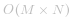
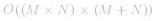
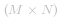

这个问题看上去相当简单，但是需要我们原地更新矩阵，也就是空间复杂度要求是 *O(1)*。

我们将用三种不同方法解决这个问题，第一个方法需要额外的存储空间而后两个不用。


#### 方法 1：额外存储空间方法

**想法**

如果矩阵中任意一个格子有零我们就记录下它的行号和列号，这些行和列的所有格子在下一轮中全部赋为零。

**算法**

1. 我们扫描一遍原始矩阵，找到所有为零的元素。
2. 如果我们找到 `[i, j]` 的元素值为零，我们需要记录下行号 `i` 和列号 `j`。
3. 用两个 `sets` ，一个记录行信息一个记录列信息。
``` C++
if cell[i][j] == 0 {
    row_set.add(i)
    column_set.add(j)
}
```
4. 最后，我们迭代原始矩阵，对于每个格子检查行 `r` 和列 `c` 是否被标记过，如果是就将矩阵格子的值设为 0。
``` C++
if r in row_set or c in column_set {
    cell[r][c] = 0
}
```
```Java []
class Solution {
  public void setZeroes(int[][] matrix) {
    int R = matrix.length;
    int C = matrix[0].length;
    Set<Integer> rows = new HashSet<Integer>();
    Set<Integer> cols = new HashSet<Integer>();

    // Essentially, we mark the rows and columns that are to be made zero
    for (int i = 0; i < R; i++) {
      for (int j = 0; j < C; j++) {
        if (matrix[i][j] == 0) {
          rows.add(i);
          cols.add(j);
        }
      }
    }

    // Iterate over the array once again and using the rows and cols sets, update the elements.
    for (int i = 0; i < R; i++) {
      for (int j = 0; j < C; j++) {
        if (rows.contains(i) || cols.contains(j)) {
          matrix[i][j] = 0;
        }
      }
    }
  }
}
```

```Python []
class Solution(object):
    def setZeroes(self, matrix):
        """
        :type matrix: List[List[int]]
        :rtype: void Do not return anything, modify matrix in-place instead.
        """
        R = len(matrix)
        C = len(matrix[0])
        rows, cols = set(), set()

        # Essentially, we mark the rows and columns that are to be made zero
        for i in range(R):
            for j in range(C):
                if matrix[i][j] == 0:
                    rows.add(i)
                    cols.add(j)

        # Iterate over the array once again and using the rows and cols sets, update the elements
        for i in range(R):
            for j in range(C):
                if i in rows or j in cols:
                    matrix[i][j] = 0
```
**复杂度分析**

* 时间复杂度： ，其中 *M* 和 *N* 分别对应行数和列数。
* 空间复杂度：*O(M+N)*。

#### 方法 2：O(1)空间的暴力

**想法**

在上面的方法中我们利用额外空间去记录需要置零的行号和列号，通过修改原始矩阵可以避免额外空间的消耗。

**算法**

1. 遍历原始矩阵，如果发现如果某个元素 `cell[i][j]` 为 0，我们将第 `i` 行和第 `j` 列的所有**非零**元素设成很大的负虚拟值（比如说 `-1000000`）。注意，正确的虚拟值取值依赖于问题的约束，任何允许值范围外的数字都可以作为虚拟之。
2. 最后，我们便利整个矩阵将所有等于虚拟值（常量在代码中初始化为 `MODIFIED`）的元素设为 0。

```Java []
class Solution {
  public void setZeroes(int[][] matrix) {
    int MODIFIED = -1000000;
    int R = matrix.length;
    int C = matrix[0].length;

    for (int r = 0; r < R; r++) {
      for (int c = 0; c < C; c++) {
        if (matrix[r][c] == 0) {
          // We modify the corresponding rows and column elements in place.
          // Note, we only change the non zeroes to MODIFIED
          for (int k = 0; k < C; k++) {
            if (matrix[r][k] != 0) {
              matrix[r][k] = MODIFIED;
            }
          }
          for (int k = 0; k < R; k++) {
            if (matrix[k][c] != 0) {
              matrix[k][c] = MODIFIED;
            }
          }
        }
      }
    }

    for (int r = 0; r < R; r++) {
      for (int c = 0; c < C; c++) {
        // Make a second pass and change all MODIFIED elements to 0 """
        if (matrix[r][c] == MODIFIED) {
          matrix[r][c] = 0;
        }
      }
    }
  }
}
```

```Python []
class Solution(object):
    def setZeroes(self, matrix):
        """
        :type matrix: List[List[int]]
        :rtype: void Do not return anything, modify matrix in-place instead.
        """
        MODIFIED = -1000000
        R = len(matrix)
        C = len(matrix[0])
        for r in range(R):
            for c in range(C):
                if matrix[r][c] == 0:
                    # We modify the elements in place. Note, we only change the non zeros to MODIFIED
                    for k in range(C):
                        matrix[r][k] = MODIFIED if matrix[r][k] != 0 else 0
                    for k in range(R):
                        matrix[k][c] = MODIFIED if matrix[k][c] != 0 else 0
        for r in range(R):
            for c in range(C):
                # Make a second pass and change all MODIFIED elements to 0 """
                if matrix[r][c] == MODIFIED:
                    matrix[r][c] = 0
```
**复杂度分析**

* 时间复杂度： ，其中 *M* 和 *N* 分别对应行数和列数。尽管这个方法避免了使用额外空间，但是效率很低，因为最坏情况下每个元素都为零我们需要访问所有的行和列，因此所有   个格子都需要访问 *(M +  N)* 个格子并置零。
* 空间复杂度：*O(1)*

**想法**

第二种方法不高效的地方在于我们会重复对同一行或者一列赋零。我们可以推迟对行和列赋零的操作。

> 我们可以用每行和每列的第一个元素作为标记，这个标记用来表示这一行或者这一列是否需要赋零。这意味着对于每个节点不需要访问 *M+N* 个格子而是只需要对标记点的两个格子赋值。

``` C++
if cell[i][j] == 0 {
    cell[i][0] = 0
    cell[0][j] = 0
}
```

这些标签用于之后对矩阵的更新，如果某行的第一个元素为零就将整行置零，如果某列的第一个元素为零就将整列置零。


**算法**

1. 遍历整个矩阵，如果 `cell[i][j] == 0` 就将第 `i` 行和第 `j` 列的第一个元素标记。
2. 第一行和第一列的标记是相同的，都是 `cell[0][0]`，所以需要一个额外的变量告知第一列是否被标记，同时用 `cell[0][0]` 继续表示第一行的标记。
3. 然后，从第二行第二列的元素开始遍历，如果第 `r` 行或者第 `c` 列被标记了，那么就将 `cell[r][c]` 设为 0。这里第一行和第一列的作用就相当于方法一中的 `row_set` 和 `column_set` 。
4. 然后我们检查是否 `cell[0][0] == 0` ，如果是则赋值第一行的元素为零。
5. 然后检查第一列是否被标记，如果是则赋值第一列的元素为零。

                   


通过上述操作得到的标记，并将标记的对于行列元素赋值为零。


```Java []
class Solution {
  public void setZeroes(int[][] matrix) {
    Boolean isCol = false;
    int R = matrix.length;
    int C = matrix[0].length;

    for (int i = 0; i < R; i++) {

      // Since first cell for both first row and first column is the same i.e. matrix[0][0]
      // We can use an additional variable for either the first row/column.
      // For this solution we are using an additional variable for the first column
      // and using matrix[0][0] for the first row.
      if (matrix[i][0] == 0) {
        isCol = true;
      }

      for (int j = 1; j < C; j++) {
        // If an element is zero, we set the first element of the corresponding row and column to 0
        if (matrix[i][j] == 0) {
          matrix[0][j] = 0;
          matrix[i][0] = 0;
        }
      }
    }

    // Iterate over the array once again and using the first row and first column, update the elements.
    for (int i = 1; i < R; i++) {
      for (int j = 1; j < C; j++) {
        if (matrix[i][0] == 0 || matrix[0][j] == 0) {
          matrix[i][j] = 0;
        }
      }
    }

    // See if the first row needs to be set to zero as well
    if (matrix[0][0] == 0) {
      for (int j = 0; j < C; j++) {
        matrix[0][j] = 0;
      }
    }

    // See if the first column needs to be set to zero as well
    if (isCol) {
      for (int i = 0; i < R; i++) {
        matrix[i][0] = 0;
      }
    }
  }
}
```

```Python []
class Solution(object):
    def setZeroes(self, matrix):
        """
        :type matrix: List[List[int]]
        :rtype: void Do not return anything, modify matrix in-place instead.
        """
        is_col = False
        R = len(matrix)
        C = len(matrix[0])
        for i in range(R):
            # Since first cell for both first row and first column is the same i.e. matrix[0][0]
            # We can use an additional variable for either the first row/column.
            # For this solution we are using an additional variable for the first column
            # and using matrix[0][0] for the first row.
            if matrix[i][0] == 0:
                is_col = True
            for j in range(1, C):
                # If an element is zero, we set the first element of the corresponding row and column to 0
                if matrix[i][j]  == 0:
                    matrix[0][j] = 0
                    matrix[i][0] = 0

        # Iterate over the array once again and using the first row and first column, update the elements.
        for i in range(1, R):
            for j in range(1, C):
                if not matrix[i][0] or not matrix[0][j]:
                    matrix[i][j] = 0

        # See if the first row needs to be set to zero as well
        if matrix[0][0] == 0:
            for j in range(C):
                matrix[0][j] = 0

        # See if the first column needs to be set to zero as well        
        if is_col:
            for i in range(R):
                matrix[i][0] = 0
```
**复杂度分析**

* 时间复杂度： 
* 空间复杂度：*O(1)*